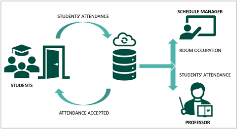

# Bachelor's Thesis: Application mobile for students attendance at VIA University College in Horsens

## Summary

## Introduction
In August 2021 VIA University College situated in Horsens, opened new facilities located in the center of the city to improve the education of its students in addition to focus on delivering an education that qualifies the work in a variety of disciplines, languages, and cultures. To improve the education of the students it is essential that the university can verify the skills and abilities of its students and professors using all the tools and metrics possible. Being able to manage the student’s attendance data with efficiency is, undoubtedly, one of the core characteristics of a successful school or university of any size. That includes internal workflows and re-designing timetables, if needed. And having knowledge of the attendance of students in class even could affects to a more positive motivating and learning environment. The lack of attendance in some classes can negatively affect the academic performance of some students, questioning the quality of the university's teaching and damaging its reputation. 
Handwritten absence of students is a laborious and tedious task that teachers do not have time to do that is why the implementation of a digital system to manage students’ attendance helps to optimize the classroom scheduling and this focus on attendance helps to a student's culture for reaching a higher learning level.

## Problem statement

With the move to the new facility, VIA University College in Horsens is experiencing crucial problems with room resources balancing the limited number of available rooms with the high number of students and lectures. By now, room schedules can be planned one week in advance, at the most. To allow a valid and precise forward planning for a longer period (e.g., a semester) it is necessary to get data about the real room occupation. The question “How to automatically register students’ attendance in lectures in order to optimize the utilization of room resources?” arises. Based on this question a list of software-engineering and business-related sub-problems are generated.

## Definition of purpose
The project serves the purpose to develop a tool that allows the VIA Horsens to improve its future use of room capacities by collecting data of real-time occupation of rooms by students during regular lectures. The data also can be used for future improvements of lectures quality and students’ academic performance.

## Requirements
In the document named **requirements.txt** you will find the requirements to execute the web application.

## Supervisors
The teachers who have guided this project are:
- Poul Væggemose (POV)  
- Lene Overgaard Sørensen (LEOS)

## Authors
This project have been developed by:
- [Anne Schneider](https://github.com/Nikaleya)
- [Nils Franke](https://github.com/Nfrankjy)
- [Jordi Lazo] (https://github.com/JordiLazo)
